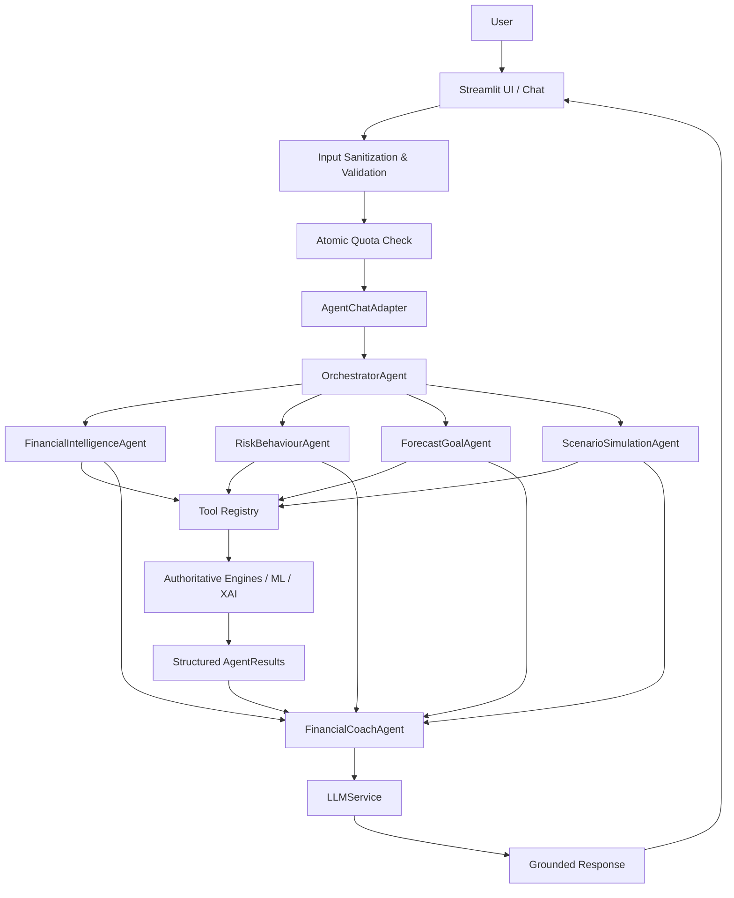
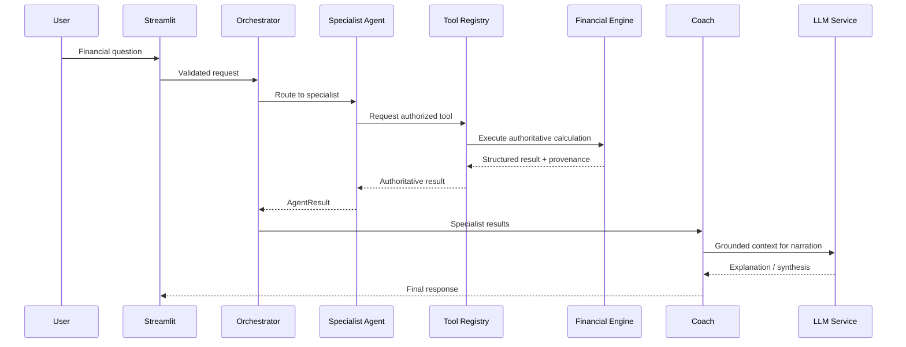

<div align="center">


### AI-Powered Financial Health Digital Twin with Multi-Agent Intelligence

<p>
  <strong>Understand your money. Simulate your future. Make better financial decisions.</strong>
</p>

[](https://python.org)
[](https://streamlit.io)
[](https://xgboost.readthedocs.io)
[](https://shap.readthedocs.io)
[](https://sqlite.org)
[](#-multi-agent-architecture)
[](#-testing)
[](#-project-status)

<br/>

> **FinTwin AI** is a Streamlit-based financial intelligence platform that builds a personalized digital twin of a user's finances and combines deterministic financial engines, machine learning, explainable AI, scenario simulation, and a six-agent conversational architecture to turn financial data into understandable, actionable insights.

</div>

---

## 📌 Table of Contents

- [Overview](#-overview)
- [Why FinTwin AI?](#-why-fintwin-ai)
- [Key Features](#-key-features)
- [Multi-Agent Architecture](#-multi-agent-architecture)
- [Financial Intelligence Pipeline](#-financial-intelligence-pipeline)
- [Financial Health Score](#-financial-health-score)
- [Machine Learning & XAI](#-machine-learning--xai)
- [Scenario & Goal Planning](#-scenario--goal-planning)
- [Application Modules](#-application-modules)
- [Project Structure](#-project-structure)
- [Technology Stack](#-technology-stack)
- [Getting Started](#-getting-started)
- [Demo Access](#-demo-access)
- [Testing](#-testing)
- [Security & Reliability](#-security--reliability)
- [Important Design Principles](#-important-design-principles)
- [Project Status](#-project-status)
- [Future Enhancements](#-future-enhancements)
- [License](#-license)

---

## 🧠 Overview

Managing personal finances is not only about tracking expenses. A useful financial system should answer questions such as:

- **How financially healthy am I?**
- **Where is my money going?**
- **What is my financial personality?**
- **How could my savings and net worth evolve?**
- **Can I afford a major goal or purchase?**
- **What happens if my salary changes or I lose my job?**
- **Which tax regime may be more beneficial?**
- **What should I prioritize first?**
- **Why did the system give me this recommendation?**

FinTwin AI addresses these questions by creating a **Financial Digital Twin** from a user's financial profile and running that state through specialized analytical engines.

The platform combines:

| Capability | Purpose |
|---|---|
| **Digital Twin** | Represents the user's current financial state |
| **Financial Health** | Produces a deterministic 0–100 health score |
| **Behavior Analysis** | Identifies spending and financial behavior patterns |
| **Financial Personality** | Classifies financial behavior into five archetypes |
| **Forecasting** | Projects savings and net-worth trajectories |
| **Scenario Simulator** | Tests financial what-if situations |
| **Tax Intelligence** | Compares Indian tax regimes and deductions |
| **Goal Planner** | Evaluates goals and required SIP contributions |
| **Explainable AI** | Explains important model-driven financial factors |
| **AI Coach** | Converts analytical results into understandable guidance |

---

## 🎯 Why FinTwin AI?

Traditional finance trackers usually focus on **recording what already happened**.

FinTwin AI focuses on:

```text
                 ┌──────────────────────┐
                 │   YOUR FINANCIAL     │
                 │       PROFILE        │
                 └──────────┬───────────┘
                            │
                            ▼
                 ┌──────────────────────┐
                 │   FINANCIAL DIGITAL  │
                 │        TWIN          │
                 └──────────┬───────────┘
                            │
          ┌─────────────────┼─────────────────┐
          ▼                 ▼                 ▼
     HEALTH & RISK      FORECASTING       SCENARIOS
          │                 │                 │
          └─────────────────┼─────────────────┘
                            ▼
                 ┌──────────────────────┐
                 │  EXPLAINABLE AI +   │
                 │    AI COACHING       │
                 └──────────┬───────────┘
                            ▼
                 ┌──────────────────────┐
                 │ ACTIONABLE FINANCIAL │
                 │     INSIGHTS         │
                 └──────────────────────┘
```

The goal is to move from **financial tracking → financial understanding → financial decision support**.

---

# ✨ Key Features

### 💰 Financial Digital Twin
- Centralized representation of the user's financial profile.
- Income, expenses, savings, investments, liabilities, assets, and insurance information.
- Session-scoped state for user isolation.
- Designed as the authoritative input state for downstream analysis.

### 📊 Six-Pillar Financial Health Score
A deterministic **0–100** score based on six financial pillars:

1. Savings Rate
2. EMI Burden
3. Emergency Fund
4. Investment Allocation
5. Insurance Adequacy
6. Debt Level

### 🤖 Six-Agent AI Architecture
Specialized agents handle different financial responsibilities while an orchestrator routes requests to the minimum required agents.

### 🔮 ML Forecasting
- XGBoost-based savings and net-worth forecasting.
- Multi-horizon financial projections.
- Model artifacts are trained offline and loaded for inference.
- Fallback deterministic projections are available where applicable.

### 🔍 Explainable AI
- TreeSHAP-based feature attribution for forecast explanations.
- Helps identify which financial inputs have the greatest influence on model output.
- Uses the actual fitted model rather than fabricated explanations.

### 🏦 Indian Tax Intelligence
- Old vs. New tax regime comparison.
- FY 2025–26 and FY 2026–27 support.
- Deduction and rebate calculations.
- Section 87A rebate handling and tax optimization.

### 🎯 Goal Planning
- Goal feasibility analysis.
- SIP requirement calculations.
- Multiple financial goals.
- Inflation-adjusted planning.

### ⚡ Scenario Simulation
Simulate major financial events such as:

| Scenario | Example Question |
|---|---|
| Salary Hike | What if my salary increases? |
| Job Loss | How resilient is my financial position? |
| Car Purchase | Can I absorb a new vehicle expense? |
| Home Loan | How would a home loan affect my finances? |
| Marriage Expense | What happens after a large one-time expense? |
| Increase SIP | What if I invest more every month? |

---

# 🤖 Multi-Agent Architecture

FinTwin AI uses **exactly six primary agents**. The deterministic financial engines and ML models remain the source of truth; agents orchestrate, interpret, and communicate their results.



## The Six Agents

| Agent | Responsibility | Typical Operations |
|---|---|---|
| **OrchestratorAgent** | Understands intent and routes work | Health, risk, forecast, goal, scenario, overview |
| **FinancialIntelligenceAgent** | Core financial intelligence | Health score, ratios, personality, tax, financial overview |
| **RiskBehaviourAgent** | Risk and behavior analysis | Debt, EMI, emergency fund, spending behavior, risk |
| **ForecastGoalAgent** | Future projections and goals | Savings forecast, net worth, goals, multi-goal planning |
| **ScenarioSimulationAgent** | What-if financial simulation | Scenario execution and before/after comparison |
| **FinancialCoachAgent** | Grounded synthesis and coaching | Prioritization, recommendations, explanation, summaries |

### Cross-Cutting Components

**Tool Registry**
- Controls which tools each agent can access.
- Prevents unauthorized tool usage.
- Preserves provenance for authoritative calculations.

**LLM Service**
- Provides linguistic synthesis and explanation.
- Supports Groq and Google Gemini providers.
- Uses deterministic fallback behavior when an LLM is unavailable.
- The LLM is **not the source of truth for financial calculations**.

**Explainable AI**
- Cross-cutting capability used by the relevant analytical agents.
- Forecast explanations use TreeSHAP on the fitted XGBoost model.

---

# 🔄 Financial Intelligence Pipeline



### Core Principle

> **Agents coordinate. Engines calculate. Models predict. XAI explains. The LLM communicates.**

This separation is central to the system's design.

---

# 🧮 Financial Health Score

The `HealthScoreEngine` computes a deterministic **0–100** score from six weighted pillars.

| Pillar | Target Benchmark | Weight |
|:---|:---:|---:|
| **Savings Rate** | ≥ 30% of monthly income | **25%** |
| **EMI Burden** | ≤ 35% of monthly income | **20%** |
| **Emergency Fund** | ≥ 6 months of expenses | **20%** |
| **Investment Ratio** | ≥ 15% in equity/SIPs | **15%** |
| **Insurance Adequacy** | Life ≥ 10× annual salary; Health ≥ ₹5L | **10%** |
| **Debt Burden** | Total debt ≤ 1.5× annual income | **10%** |

### Score Interpretation

| Score | Grade | Interpretation |
|:---:|:---:|---|
| **80–100** | A | Strong financial health |
| **60–79** | B | Generally healthy with improvement opportunities |
| **40–59** | C | Moderate financial stress / gaps |
| **< 40** | D | High-priority financial weaknesses |

The health calculation remains **deterministic and engine-controlled** rather than being generated by the chatbot.

---

# 📈 Machine Learning & XAI

## ML Components

| Component | Algorithm | Purpose |
|---|---|---|
| Savings Forecast | **XGBoost Regressor** | Future savings trajectory |
| Net Worth Forecast | **XGBoost / deterministic trajectory engine** | Future net-worth projection |
| Financial Personality | **K-Means + StandardScaler** | Behavioral segmentation |
| Forecast Explanation | **TreeSHAP** | Model feature attribution |

### Financial Personality

The clustering system uses five financial behavior archetypes:

- **Saver**
- **Investor**
- **Spender**
- **Debt Heavy**
- **Balanced Planner**

### Explainability Flow

```text
User Financial State
        │
        ▼
Pre-trained XGBoost Model
        │
        ▼
Prediction
        │
        ▼
TreeSHAP
        │
        ▼
Feature Contributions
        │
        ▼
Human-readable Explanation
```

Training is performed **offline**. The live application uses user/session financial state for inference and does not retrain models during normal application usage.

---

# 🎯 Scenario & Goal Planning

FinTwin AI is designed not only to describe the present but also to explore possible futures.

### Scenario Simulation


### Goal Planning

The Goal Planner evaluates whether a target is achievable using the user's current financial position and required savings/investment contribution.

Typical goals include:

- 🏠 Home purchase
- 🎓 Education
- ✈️ Vacation
- 💍 Major life expenses
- 🏖️ Retirement
- Other user-defined financial targets

---

# 📱 Application Modules

FinTwin AI provides an integrated Streamlit dashboard with **11 application pages**:

| # | Module | Purpose |
|:---:|---|---|
| 1 | **Digital Twin** | Build and inspect the financial profile |
| 2 | **Financial Health** | Health score and financial diagnostics |
| 3 | **Behavior Analysis** | Spending patterns and behavioral insights |
| 4 | **Financial Personality** | Financial behavior classification |
| 5 | **Forecasting** | Savings and net-worth projections |
| 6 | **Scenario Simulator** | Financial what-if analysis |
| 7 | **Tax Intelligence** | Indian tax regime comparison |
| 8 | **AI Coach** | Conversational financial guidance |
| 9 | **Goal Planner** | Goal feasibility and SIP planning |
| 10 | **Explainable AI** | Model and forecast explanations |
| 11 | **Settings** | Account and session management |

---

# 🗂️ Project Structure

```text
FinTwin-AI_V2/
│
├── app.py                         # Streamlit application entry point & router
├── config.py                      # Central configuration and financial constants
├── requirements.txt               # Python dependencies
├── README.md                      # Comprehensive project documentation
├── LICENSE                        # MIT License
├── .gitignore                     # Git exclusions & secret protection
├── .env.example                   # Environment variable template
│
├── .streamlit/
│   ├── config.toml                # Streamlit UI & theme configuration
│   └── secrets.toml               # Local secrets (git-ignored)
│
├── agents/                        # Multi-agent intelligence architecture
│   ├── schemas.py                 # Pydantic schemas & state models
│   ├── state.py                   # Shared session state & provenance
│   ├── orchestrator.py            # Intent classification & dynamic routing
│   ├── financial_intelligence.py  # Deterministic financial intelligence agent
│   ├── risk_behaviour.py          # Risk profile & behavioral analysis agent
│   ├── forecast_goal.py           # Wealth projection & goal feasibility agent
│   ├── scenario_simulation.py     # What-if scenario stress-testing agent
│   ├── financial_coach.py         # Guidance synthesis & action planning agent
│   ├── tool_registry.py           # Role-based tool registry & authorization
│   └── llm.py                     # Provider-agnostic LLM client (Groq / Gemini / Fallback)
│
├── models/                        # Analytical, ML & Explainability engines
│   ├── twin_engine.py             # Financial Digital Twin & deterministic core
│   ├── predictor.py               # XGBoost forecasting & scenario projection
│   ├── clustering.py              # K-Means financial personality profiling
│   └── explainability.py          # TreeSHAP feature attribution & XAI plots
│
├── data/
│   ├── generator.py               # Synthetic financial population generator
│   ├── preprocessor.py            # Feature engineering & offline preprocessing
│   ├── raw/                       # Synthetic training dataset (Indian salaried cohort)
│   └── models/                    # Pre-trained ML artifacts & benchmark distributions
│
├── database/
│   ├── connection.py              # Thread-safe SQLite connection pool (WAL mode)
│   ├── db_manager.py              # User management, atomic quotas & persistence
│   └── schema.sql                 # Database relational schema DDL
│
├── pages/                         # Streamlit dashboard modules
│   ├── 01_Digital_Twin.py         # Financial profile & real-time balance sheet
│   ├── 02_Financial_Health.py     # 0–100 deterministic financial health score
│   ├── 03_Behavior_Analysis.py    # Cash flow patterns, ratios & behavioral metrics
│   ├── 04_Financial_Personality.py# ML archetype classification & benchmarking
│   ├── 05_Forecasting.py          # Multi-year savings & net worth trajectories
│   ├── 06_Scenario_Simulator.py   # What-if event simulations & stress testing
│   ├── 07_Tax_Intelligence.py     # Indian Old vs. New Tax Regime comparison
│   ├── 08_AI_Coach.py             # Multi-agent conversational financial coach
│   ├── 09_Goal_Planner.py         # Multi-goal SIP calculator & timeline feasibility
│   ├── 10_Explainable_AI.py       # SHAP waterfalls & feature importance insights
│   └── 11_Settings.py             # User profile, privacy controls & session settings
│
├── utils/                         # Core system utilities & business logic
│   ├── agent_chat_adapter.py      # Conversational interface → agent bridge
│   ├── auth.py                    # Argon2 hashing & authentication handlers
│   ├── avatar.py                  # User avatar customization & state
│   ├── chatbot.py                 # Chat UI components & streaming renderer
│   ├── coach.py                   # Rule-based fallback coaching synthesis
│   ├── email_service.py           # SMTP OTP delivery & verification
│   ├── export.py                  # Financial data export (CSV/JSON)
│   ├── goal_engine.py             # Mathematical goal planning & SIP engine
│   ├── master_report.py           # Comprehensive financial health compilation
│   ├── pdf_report.py              # ReportLab multi-page PDF generation
│   ├── security.py                # Input sanitization & prompt-injection defense
│   ├── session.py                 # Isolated session state management
│   ├── simulator.py               # Deterministic scenario simulation engine
│   ├── splash_screen.py           # Onboarding & brand splash screens
│   ├── tax_calculator.py          # Indian Income Tax Act calculation rules
│   ├── ui_components.py           # Reusable UI widgets & metric cards
│   ├── validators.py              # Strict financial input validation
│   └── visualizer.py              # Interactive Plotly charts & dashboards
│
├── tests/                         # 26 automated regression & integration test suites
│   ├── test_agent_chat_adapter.py
│   ├── test_agent_schemas.py
│   ├── test_auth_security.py
│   ├── test_avatar_system.py
│   ├── test_caching_performance.py
│   ├── test_chatbot_agent_integration.py
│   ├── test_chatbot_cleanup.py
│   ├── test_chatbot_final_verification.py
│   ├── test_financial_coach_agent.py
│   ├── test_financial_core.py
│   ├── test_financial_intelligence_agent.py
│   ├── test_forecast_goal_agent.py
│   ├── test_input_validation.py
│   ├── test_llm.py
│   ├── test_orchestrator.py
│   ├── test_pdf_report.py
│   ├── test_phase5_cache_correctness.py
│   ├── test_phase5_quota_concurrency_race.py
│   ├── test_phase5_rerun_db_optimization.py
│   ├── test_phase5_step4_optimizations.py
│   ├── test_phase5_system_audit.py
│   ├── test_privacy_security.py
│   ├── test_risk_behaviour_agent.py
│   ├── test_scenario_simulation.py
│   ├── test_tool_registry.py
│   └── test_visualizer.py
│
├── scripts/                       # Maintenance & administration scripts
│   ├── clear_registered_users.py
│   ├── reset_test_users.py
│   ├── security_audit.py
│   └── test_smtp_connection.py
│
└── training/
    └── train_offline.py           # Offline ML training pipeline (XGBoost + KMeans)
```

---

# 🛠️ Technology Stack

| Layer | Technologies |
|---|---|
| **Frontend / UI** | Streamlit |
| **Programming Language** | Python 3.10+ / 3.11+ / 3.13+ |
| **Data Processing** | Pandas, NumPy |
| **Machine Learning** | Scikit-learn, XGBoost |
| **Clustering** | K-Means |
| **Explainable AI** | SHAP / TreeSHAP |
| **Visualization** | Plotly |
| **Database** | SQLite (WAL mode, parameterized transactions) |
| **Authentication** | Argon2-based password hashing |
| **PDF Reports** | ReportLab |
| **AI Providers** | Groq, Google Gemini (with deterministic fallbacks) |
| **Testing** | Pytest (26 test suites, 374 passed, 0 warnings) |
| **Model Storage** | Pre-trained JSON artifacts |
| **Architecture** | Custom lightweight multi-agent orchestration |

---

# 🚀 Getting Started

## 1. Clone the Repository

```bash
git clone https://github.com/AlokRana01/FinTwin-AI_V2.git
cd FinTwin-AI_V2
```

## 2. Create a Virtual Environment

### Windows

```bash
python -m venv .venv
.venv\Scripts\activate
```

### macOS / Linux

```bash
python -m venv .venv
source .venv/bin/activate
```

## 3. Install Dependencies

```bash
pip install -r requirements.txt
```

## 4. Configure Environment Variables

Copy the example environment file:

```bash
# Windows
copy .env.example .env

# macOS / Linux
cp .env.example .env
```

Optional AI provider keys:

```env
GROQ_API_KEY=your_groq_api_key_here
GEMINI_API_KEY=your_gemini_api_key_here
```

If AI provider keys are unavailable, the application can fall back to deterministic coaching behavior.

> **Security:** Never commit `.env` or `.streamlit/secrets.toml` to GitHub.

## 5. Run the Application

```bash
streamlit run app.py
```

Open:

```text
http://localhost:8501
```

---

# 🔑 Demo Access

For local demonstration, the project supports a demo account and Guest Mode.

| Access Mode | Email | Password | Daily Chat Quota |
|---|---|---|---:|
| **Demo User** | `demo@fintwin.app` | `Demo@123` | **40 messages/day** |
| **Guest Mode** | One-click access | — | **12 messages/day** |

> For a public deployment, change/remove demo credentials and review all seeded account behavior before exposing the application.

---

# 🧪 Testing

FinTwin AI includes a comprehensive automated regression suite covering:

- Multi-agent orchestration
- Financial calculations
- Health scoring
- Forecasting
- Explainable AI
- Authentication
- Session isolation
- Chatbot integration
- Database operations
- Quota concurrency
- Input validation
- LLM abstraction and fallbacks

Run the complete suite:

```bash
pytest -q
```

Current validated baseline:

```text
374 passed
0 warning
0 failed
0 skipped
```

A green test suite is a prerequisite for considering a change production-ready.

---

# 🔐 Security & Reliability

FinTwin AI incorporates several safeguards around user data, financial calculations, and AI behavior.

| Area | Approach |
|---|---|
| **Password Security** | Argon2 password hashing |
| **Session Isolation** | User-specific Streamlit session state |
| **Chat Quotas** | Atomic SQLite quota reservation |
| **SQLite Concurrency** | WAL mode + busy timeout + transactional reservation |
| **LLM Secrets** | Environment variables / Streamlit secrets |
| **Prompt Safety** | Input sanitization and prompt-injection containment |
| **Financial Calculations** | Deterministic source-of-truth engines |
| **ML Inference** | Pre-trained artifacts; no runtime retraining |
| **XAI** | Actual fitted model + TreeSHAP |
| **Fallbacks** | Deterministic coaching when LLM services are unavailable |
| **Global User State** | Avoided; session-scoped financial state |

### Chat Quotas

- **Authenticated users:** 40 messages/day
- **Guest users:** 12 messages/day
- Invalid/empty messages do not consume a quota slot.
- Quota reservation is performed atomically before expensive agent/LLM processing.

---

# 🧩 Important Design Principles

### 1. Deterministic Engines Are the Source of Truth

Financial numbers are produced by existing analytical engines and ML models.

### 2. Agents Do Not Reimplement Financial Formulas

Agents call authorized tools through the Tool Registry instead of duplicating calculations.

### 3. LLMs Explain — They Do Not Authorize Financial Truth

The LLM is used for:
- explanation,
- summarization,
- prioritization,
- conversational presentation.

It is not trusted to independently calculate authoritative financial values.

### 4. Training and Live Inference Are Separate

```text
Offline
  │
  ├── Synthetic Data
  ├── Preprocessing
  ├── Model Training
  └── Model Artifacts
            │
            ▼
       Live Application
            │
            └── User Financial State → Model Inference
```

The training dataset is not used as the user's live financial profile.

### 5. Minimal-Agent Routing

The Orchestrator sends a request only to the agents required for that task.

For example:

```text
Health Question
    ↓
FinancialIntelligenceAgent
    ↓
FinancialCoachAgent
```

rather than invoking every agent unnecessarily.

### 6. Provenance Matters

Authoritative results carry provenance information so the system can distinguish deterministic calculations, model outputs, heuristic recommendations, and fallbacks.

---

# 📊 Project Status

| Area | Status |
|---|:---:|
| Financial Digital Twin | ✅ Complete |
| Financial Health Engine | ✅ Complete |
| ML Forecasting | ✅ Complete |
| Financial Personality | ✅ Complete |
| Scenario Simulation | ✅ Complete |
| Goal Planning | ✅ Complete |
| Indian Tax Intelligence | ✅ Complete |
| Explainable AI | ✅ Complete |
| Six-Agent Architecture | ✅ Complete |
| AI Coach | ✅ Complete |
| Chatbot Migration | ✅ Complete |
| Security & Session Isolation | ✅ Validated |
| Quota Concurrency | ✅ Validated |
| Performance Optimization | ✅ Validated |
| Automated Tests | ✅ 374 Passed |
| Browser Smoke Testing | ✅ Validated |
| Production Deployment Validation | ✅ Complete |

### Current Status

> **READY FOR DEPLOYMENT**

The project has completed its architecture, integration, testing, cleanup, and deployment-validation stages.

---

# 🔮 Future Enhancements

Possible future improvements include:

- PostgreSQL for multi-instance/cloud deployments.
- Persistent long-term financial memory.
- Additional financial datasets and real-world benchmarking.
- More sophisticated time-series forecasting.
- Mobile/PWA experience.
- Portfolio-level investment analytics.
- Financial document ingestion.
- Automated financial alerts.
- Expanded scenario libraries.
- Cloud observability and monitoring.
- CI/CD pipeline with automated deployment.

These are future enhancements and are **not required for the current MSc project deployment**.

---

# 📄 License

This project is licensed under the **MIT License**.

See [`LICENSE`](LICENSE) for details.

---

<div align="center">

### FinTwin AI

**A Financial Digital Twin powered by Data Science, Machine Learning, Explainable AI, and Multi-Agent Intelligence.**

Built as an MSc Data Science project.

<br/>

⭐ If you find the project useful, consider giving it a star.

</div>
